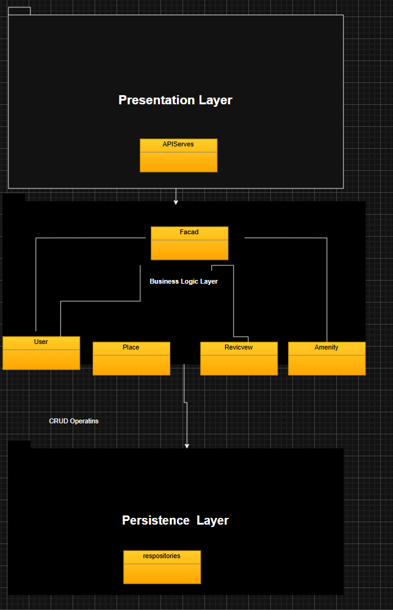

# HBnB Evolution - Technical Documentation (Part 1)

## 1. Introduction

This technical document provides a complete overview of the architecture and design of the **HBnB Evolution** project.  
HBnB Evolution is a simplified AirBnB-like application that allows users to register, manage places, associate amenities, and submit reviews.

The purpose of this documentation is to serve as a blueprint for the implementation phases of the project by clearly defining:

- The layered architecture of the system.
- The core business entities and their relationships.
- The interactions between layers through different API workflows.

This document includes a high-level package diagram, a detailed class diagram for the Business Logic layer,
and sequence diagrams describing the flow of major API operations.

---

## 2. High-Level Architecture

### 2.1 Architecture Overview

HBnB Evolution follows a layered architecture composed of three main layers:

- **Presentation Layer (API Layer)**  
  Responsible for handling user requests, validating input data, and returning responses.

- **Business Logic Layer**  
  Contains the main application logic, business rules, and core entities (User, Place, Review, Amenity).

- **Persistence Layer (Database Layer)**  
  Responsible for storing and retrieving data. This layer will be fully implemented in later parts of the project.

To simplify communication between layers, the application uses the **Facade Pattern**.  
The Presentation Layer communicates only with a Facade, which provides a unified interface to the Business Logic layer.

This design improves maintainability, modularity, and makes the system easier to extend.

---

### 2.2 High-Level Package Diagram

The following diagram illustrates the high-level structure of the HBnB Evolution application and how the layers interact:

#### Explanation

- The **Presentation Layer** sends requests to the **Facade**.
- The **Facade** communicates with the **Business Logic Layer** to process operations.
- The **Business Logic Layer** interacts with the **Persistence Layer** to store and retrieve information.
- The **Persistence Layer** returns data back through the Business Logic Layer to the Presentation Layer.

This architecture ensures clear separation of responsibilities and avoids direct dependencies between the API and database logic.

---

## 3. Business Logic Layer Design

### 3.1 Overview

The Business Logic Layer contains the core entities of the HBnB system:

- **User**
- **Place**
- **Review**
- **Amenity**

Each entity includes:

- A unique identifier (`id`)
- Audit fields (`created_at`, `updated_at`) for tracking creation and updates

These entities represent the main objects required to implement an AirBnB-like platform.

---

### 3.2 Detailed Class Diagram

The following class diagram describes the entities, their attributes, methods, and relationships:

iagram for Business Logic Layer](./Detailed%20Class%20Diagram%20for%20Business%20Logic%20Layer.md)

#### Explanation

This diagram provides a complete overview of the Business Logic layer entities and their relationships:

- **User** represents registered users in the system.
- **Place** represents a property owned by a user.
- **Review** represents user feedback and ratings for a place.
- **Amenity** represents features like WiFi, Pool, Parking, etc.

Relationships shown:

- One **User** can own many **Places** (One-to-Many).
- One **User** can write many **Reviews** (One-to-Many).
- One **Place** can have many **Reviews** (One-to-Many).
- **Places** and **Amenities** are linked in a Many-to-Many relationship.

The diagram also includes audit fields (`created_at`, `updated_at`) to ensure proper tracking of entity updates.

---

### 3.3 Entities Description

#### 3.3.1 User Entity

The `User` entity represents system users.

**Main Attributes:**

- `id`
- `first_name`
- `last_name`
- `email`
- `password`
- `is_admin`
- `created_at`
- `updated_at`

**Main Responsibilities:**

- Register into the system.
- Update profile information.
- Be identified as a regular user or administrator.

A user can own multiple places and can write reviews.

---

#### 3.3.2 Place Entity

The `Place` entity represents a property listed by a user.

**Main Attributes:**

- `id`
- `title`
- `description`
- `price`
- `latitude`
- `longitude`
- `owner_id`
- `created_at`
- `updated_at`

**Main Responsibilities:**

- Allow owners to create and manage properties.
- Store location and pricing information.
- Be associated with amenities.

A place belongs to one owner and can have multiple reviews.

---

#### 3.3.3 Review Entity

The `Review` entity represents feedback submitted by a user about a place.

**Main Attributes:**

- `id`
- `rating`
- `comment`
- `place_id`
- `user_id`
- `created_at`
- `updated_at`

**Main Responsibilities:**

- Allow users to rate places.
- Store written feedback and rating score.
- Be associated with both the user and the place.

---

#### 3.3.4 Amenity Entity

The `Amenity` entity represents a feature that can be attached to a place.

**Main Attributes:**

- `id`
- `name`
- `description`
- `created_at`
- `updated_at`

**Main Responsibilities:**

- Provide additional features for places (WiFi, Pool, Parking, etc).
- Be reusable across multiple places.

Amenities can be linked to multiple places, and places can include multiple amenities.

---

### 3.4 Summary of Relationships

- A **User** can own multiple **Places** (One-to-Many).
- A **User** can write multiple **Reviews** (One-to-Many).
- A **Place** can have multiple **Reviews** (One-to-Many).
- A **Place** can include multiple **Amenities** (Many-to-Many).

These relationships ensure that the system supports realistic booking platform behavior.

---

## 4. API Interaction Flow (Sequence Diagrams)

### 4.1 Overview

Sequence diagrams describe the flow of requests through the system and show how different layers communicate.

Each sequence diagram follows the same main flow:

User → Presentation Layer → Facade → Business Logic → Persistence Layer → Response

These diagrams help define the interaction between components and ensure that the layered architecture is respected.

---

## 4.2 User Registration Sequence Diagram

The following sequence diagram describes the registration process for a new user:

#### Explanation

1. The user sends a registration request to the API.
2. The API forwards the request to the Facade.
3. The Facade calls the business logic to validate user data.
4. The system checks if the email already exists.
5. If valid, a new `User` object is created.
6. The Persistence Layer saves the user.
7. A success response is returned to the user.

This workflow ensures that duplicate users are not created and that user information is stored correctly.

---

## 4.3 Place Creation Sequence Diagram

The following sequence diagram describes the process of creating a new place:

#### Explanation

1. The owner sends a request to create a place.
2. The API forwards the request to the Facade.
3. The Facade calls the business logic to validate the request.
4. The system verifies that the owner exists.
5. The system validates place data (title, price, latitude, longitude).
6. A new `Place` object is created.
7. The Persistence Layer stores the new place.
8. A success response is returned.

This workflow ensures that only valid owners can create places and that place data is stored properly.

---

## 4.4 Review Submission Sequence Diagram

The following sequence diagram describes how a user submits a review for a place:

#### Explanation

1. The user submits a review request.
2. The API forwards the request to the Facade.
3. The Facade sends the request to the business logic.
4. The system verifies that the user exists.
5. The system verifies that the place exists.
6. The system validates the rating value.
7. A new `Review` object is created.
8. The Persistence Layer saves the review.
9. A success response is returned.

This workflow ensures reviews are always linked to valid users and valid places.

---

## 4.5 Fetch Places Sequence Diagram

The following sequence diagram describes how the system retrieves a list of available places:

#### Explanation

1. The user requests a list of places.
2. The API forwards the request to the Facade.
3. The Facade calls the business logic to process the request.
4. The Persistence Layer retrieves all stored places.
5. The system returns:
   - a list of places if available, OR
   - an empty list if no places exist.
6. The API returns the response to the user.

The diagram includes an alternative flow to represent cases where no places are found.

---

## 5. Conclusion

This technical document compiles the architectural and design documentation of the HBnB Evolution application.  
It defines the system’s layered structure, explains the facade communication pattern, and documents the main business entities and their relationships.

The included diagrams describe the main API workflows and demonstrate how information flows across the different layers.  
This documentation will serve as the foundation for implementing the project in future parts.
