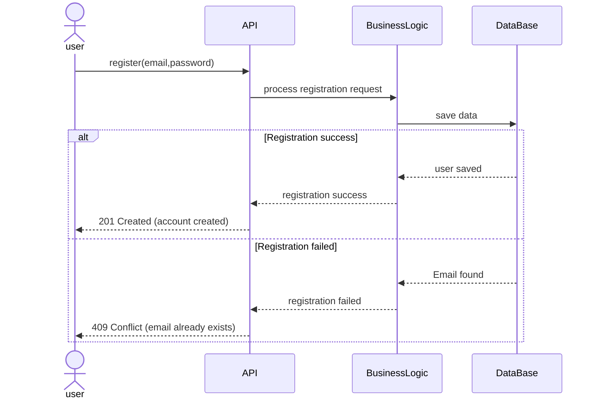
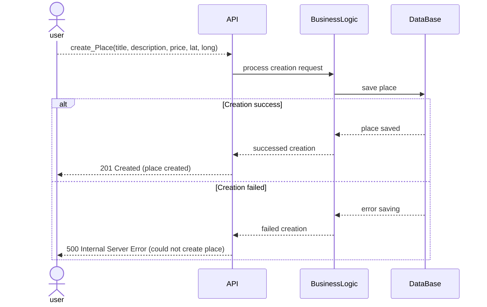

# TASK 2 — Sequence Diagrams for API Calls

This section presents sequence diagrams illustrating the interaction flow between the **Presentation Layer (API)**, **Business Logic Layer**, and **Persistence Layer (Database)** for the main API use cases of the HBnB Evolution application.

---

## 2.1 User Registration :

### Description
This API call handles the registration of a new user. The system receives user email and password, validates the input, and persists the user information in the database.

### Flow Summary
- The user sends a registration request to the API.  
- The API forwards the request to the Business Logic Layer for processing.  
- The Business Logic Layer interacts with the Database to save the user.  
- Appropriate HTTP responses are returned depending on success or failure.

### Sequence Diagram

Explanatory Notes

The API (Presentation Layer) receives the registration request and forwards it to the Business Logic Layer.

The Business Logic Layer interacts with the Database to persist the user.

201 Created is returned if registration is successful; 409 Conflict if the email already exists.

Highlights separation of responsibilities and proper handling of success and failure scenarios.

2.2 Place Creation :
Description

This API call allows a registered user to create a new place listing. The system validates the input and stores the place in the database.

Flow Summary

The client sends place details to the API.

The API forwards the creation request to the Business Logic Layer.

The Business Logic Layer saves the place in the Database.

Success or failure HTTP responses are returned.

Sequence Diagram
sequenceDiagram
    actor user
    participant API
    participant BusinessLogic
    participant DataBase


    
Explanatory Notes

The API receives the creation request and forwards it to the Business Logic Layer.

The Business Logic Layer interacts with the Database to save the place.

201 Created is returned on success; 500 Internal Server Error on failure.

Shows validation and persistence responsibilities across layers.

2.3 Review Submission — POST /places/{id}/reviews
Description

This API call handles the submission of a review for a specific place by a registered user.

Flow Summary

The client submits a review to the API.

The API forwards the request to the Business Logic Layer.

The Business Logic Layer saves the review in the Database.

Appropriate HTTP responses are returned based on success or validation failure.

Sequence Diagram
sequenceDiagram
    actor user
    participant API
    participant BusinessLogic
    participant DataBase
    
```mermaid
sequenceDiagram
    actor user
    participant API
    participant BusinessLogic
    participant DataBase

    user->>API: submit_Review(Rating, comment)
    API->>BusinessLogic: send review 
    BusinessLogic->>DataBase: save review 
    alt submission succesed 
        DataBase-->>BusinessLogic: review saved
        BusinessLogic-->>API: submission success
        API-->>user: 201 Created (review submitted)
    else invalid data 
        BusinessLogic-->>API: validation failed
        API-->>user: 400 Bad Request (invalid data)
    end
 ```

Explanatory Notes

The API forwards the review request to the Business Logic Layer.

The Business Logic Layer interacts with the Database to persist the review.

Success returns 201 Created; invalid input returns 400 Bad Request.

Shows clear validation and persistence steps.

2.4 Fetching a List of Places :
Description

This API call retrieves a list of places based on criteria such as location, price, or amenities.

Flow Summary

The client sends a query request to the API.

The API forwards it to the Business Logic Layer for processing.

The Business Logic Layer queries the Database for matching places.

Responses reflect the result of the query.

Sequence Diagram
sequenceDiagram
    actor user
    participant API
    participant BusinessLogic
    participant DataBase

```mermaid
sequenceDiagram
    actor user
    participant API
    participant BusinessLogic
    participant DataBase

    user->>API: get_place(criteria)
    API->>BusinessLogic: process request
    BusinessLogic->>DataBase: fetch list of places
    alt list exists  
        DataBase-->>BusinessLogic: list exists
        BusinessLogic-->>API: return list
        API-->>user: 200 Found (list of places)
    else Empty list
        DataBase-->>BusinessLogic: Empty list
        BusinessLogic-->>API: return empty list
        API-->>user: 200 Found (no places found)
    else list does not exist 
        DataBase-->>BusinessLogic: no list found
        BusinessLogic-->>API: fetch failed 
        API-->>user: 500 Internal Server Error 
    end
```
    
Explanatory Notes

The API receives the request and forwards it to the Business Logic Layer.

The Business Logic Layer queries the Database for matching results.

200 Found is returned if places exist or are empty; 500 Internal Server Error if the query fails.

Highlights layered flow and proper handling of different scenarios.
