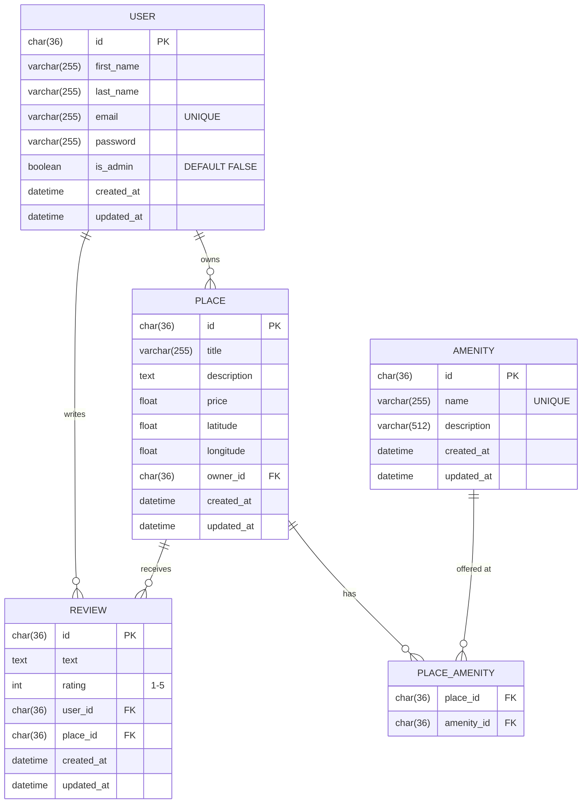

# HBnB — Entity Relationship Diagram

## Relationship Summary

| Relationship | Type | Description |
|---|---|---|
| User → Place | One-to-Many | A user can own many places; each place has exactly one owner |
| User → Review | One-to-Many | A user can write many reviews; each review belongs to one user |
| Place → Review | One-to-Many | A place can have many reviews; each review belongs to one place |
| Place ↔ Amenity | Many-to-Many | Via `PLACE_AMENITY`; a place can have many amenities and vice-versa |

## Constraints

- `REVIEW(user_id, place_id)` — **UNIQUE**: one review per user per place
- `REVIEW.rating` — **CHECK**: must be between 1 and 5
- `USER.email` — **UNIQUE**: no duplicate accounts
- `AMENITY.name` — **UNIQUE**: no duplicate amenity names
- All FK relationships cascade on delete

## Integration into GitHub / GitLab

Copy the `mermaid` code block above directly into any `.md` file in your repository.
GitHub renders Mermaid diagrams natively in markdown previews.

To render and export as PNG/SVG, paste only the diagram body (starting with `erDiagram`) into
[Mermaid Live Editor](https://mermaid.live) and use the **Download PNG** / **Download SVG** button.
